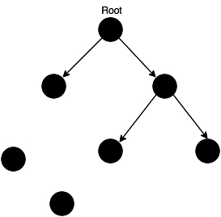
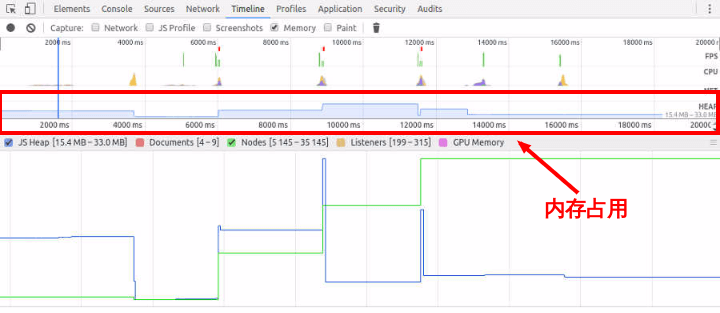
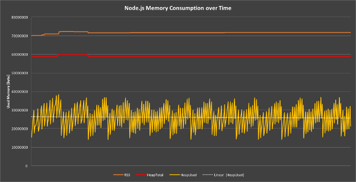
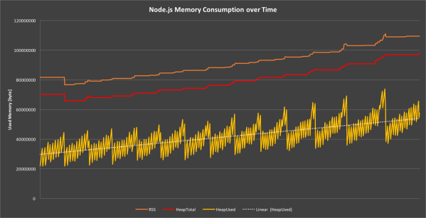

#### JavaScript垃圾回收及内存泄漏

```JavaScript
(1).内存-内存泄漏
    1.程序的运行需要内存
    2.只要程序提出要求,操作系统或者运行时（runtime）就必须供给内存
    3.对于持续运行的服务进程(daemon),必须及时释放不再用到的内存
    4.否则内存占用越来越高,轻则影响系统性能,重则导致进程崩溃
    5.***不再用到的内存，没有及时释放，就叫做内存泄漏(memory leak)***
    6.有些语言（比如 C 语言）必须手动释放内存，程序员负责内存管理。
```

```javaScript
(2).垃圾回收机制
    垃圾回收机制怎么知道,哪些内存不再需要呢？
    1.最常使用的方法叫做"引用计数"(reference counting) -> 语言引擎有一张"引用表"
    2.保存了内存里面所有的资源(通常是各种值)的引用次数
    3.如果一个值的引用次数是0,就表示这个值不再用到了,因此可以将这块内存释放
    

    上图中，左下角的两个值，没有任何引用，所以可以释放。
    如果一个值不再需要了，引用数却不为0，垃圾回收机制无法释放这块内存，从而导致内存泄漏。

    举例:
        const arr = [1, 2, 3, 4];
        console.log('hello world');
        1.上面代码中,数组[1, 2, 3, 4]是一个值,会占用内存
        2.变量arr是仅有的对这个值的引用,因此引用次数为1
        3.尽管后面的代码没有用到arr,它还是会持续占用内存
        4.如果增加一行代码,解除arr对[1, 2, 3, 4]引用,这块内存就可以被垃圾回收机制释放了
        let arr = [1, 2, 3, 4];
        console.log('hello world');
        arr = null;
        5.上面代码中,arr重置为null,就解除了对[1, 2, 3, 4]的引用,引用次数变成了0,内存就可以释放出来了
        6.因此,并不是说有了垃圾回收机制,程序员就轻松了
        7.你还是需要关注内存占用 -> 那些很占空间的值,一旦不再用到,你必须检查是否还存在对它们的引用
        8.如果是的话，就必须手动解除引用

```
```javaScript
(3).内存泄漏的识别方法
    怎样可以观察到内存泄漏呢？
    1.经验法则是: 如果连续五次垃圾回收之后,内存占用一次比一次大,就有内存泄漏
    2.这就要求实时查看内存占用。
    
    Chrome 浏览器查看内存占用,按照以下步骤操作
    
    1.打开开发者工具,选择 Timeline 面板
    2.在顶部的Capture字段里面勾选 Memory
    3.点击左上角的录制按钮
    4.在页面上进行各种操作,模拟用户的使用情况
    5.一段时间后，点击对话框的 stop 按钮,面板上就会显示这段时间的内存占用情况


    如果内存占用基本平稳,接近水平,就说明不存在内存泄漏
    

    反之,就是内存泄漏了
    
    
```