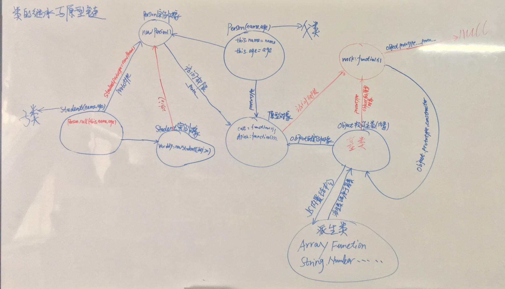

[返回目录](./README.md)

## 基于原型构建的面向对象系统

### 一、JavaScript 语言设计思路及原理 

> 好东西都是最先看起来枯燥的

(1) 都是借鉴来的

    1.C语言的基本语法
    2. JAVA的数据类型 和 内存管理
    3.scheme的函数提升“第一等公民”
    4.prototype的继承机制

(2) JavaScript组成

    1.javascript = ECMAScript + BOM + DOM
    2.javascript = 函数式编程 + 面向对象编程
    3.这种开发模式中，你的类或主对象(被称为可观察的对象)会通知其他感兴趣的类或对象(称为观察者)，并提供相关信息(事件)


(3) 宿主环境和宿主环境对象 -> JavaScript是一种脚本语言，所以有宿主和JS引擎

    1.宿主环境 ：浏览器
    2.宿主环境对象 ：window 对象（公共对象系统）
    3.ECMA 没有对宿主环境进行统一标准，所以宿主环境对象略有差异
    4.全局下定义的变量和函数都会成为 window 的属性和方法


(4) 区别对象

    1.本地对象  => 构造函数
    2.内置对象  => Math: 区别于本地对象不需要 new 成实例来使用;
                  global:全局对象
    3.宿主对象  => BOM -> 浏览器对象模型 -> 核心对象window
                  DOM -> 文档的对象模型 -> 核心对象 document,element


(5) JS 面向对象的基本规则

    1.对象是什么? 

```JavaScript
// 对象就是 属性跟方法的综合体
小明  {
    属性 ：历史不好 为人正直  严肃
    方法 ：吃  喝  拉   撒
}   
小明.吃() 
```

    2.对象是怎么来的？由类(构造函数)实例化得来的
    3.先有类后有对象，我们不能操作类，只能操作类的实例化对象。
      通过关键字 new 实例化，那么此时的实例对象就继承了该类的所有封装的属性和方法
    4.不存在独立的 属性/函数(方法) --> 都必须是某个对象的 属性/方法 
    5.对象中的属性和方法的来源 --> 继承和自身的扩展,因为JS的面向对象是基于原型构建的
    6.对象的检索机制 --> 先找自己在找原型
    7.JavaScript 是没有继承的概念的，继承可以看做是访问权限
   

(6) prototype 原型编程语言的 基本规则

    1.所有的数据都是对象 
    2.对象会记住他的原型 
    3.当请求访问对象的某个方法，无法响应时，会把这个请求委托给他自己的原型  =>  原型链


### 二、JS 中的构造函数

> 原型及原型链的前哨，站好每一班岗

(1) 什么是构造函数?

    1.在 JS 中可以看做是类的存在
    2.通过 new 可以得到类的实例对象
    3.并且实例对象继承类的属性和方法


(2) 构造函数的写法与构造函数的实例对象执行流程

```JavaScript
// 1. 声明 Person 类
function Person() {
    this.name = "ddy1"
}
// 2.封装 Person 类的属性和方法
Person.prototype = {
    name : "ddy2",
    age : 27,
    work : function(){
        console.log(this.name + "正在工作")
    }
}
// 3.实例化对象
var ddy = new Person()

// 4.访问构造函数内属性和方法顺序
// 4.1 先在构造函数内部去找
console.log(ddy.name) // ddy1
delete ddy.name
// 4.2 没找到然后去构造函数的原型对象上去找
console.log(ddy.name) // ddy2
ddy.work() // ddy2正在工作
// 4.3 在没找到会去构造函数继承的类的原型对象找，直到 Object 的原型对象上 具体查看下面的原型

```

(3) 构造函数与内存

    1.使用 this 将属性或者方法写在构造函数里，那么通过 new 创建的实例其实是复制了这个类的属性和方法，从而增加了内存消耗，浪费资源

```JavaScript
 function Person(){   
    this.age=27
    this.eat=function(){}
}
var ddy = new Person();
```

    2.如果把这些属性和方法写在 prototype 里，那么实例化的类只是继承了它的原型，对原型上的属性和方法具有了访问权限，所以这么做节约了内存。
```javaScript
Person.prototype = {
    constructor : Person,
    age : 30,
    play : function(){}
}
```

(4) 普通函数与构造函数的区别

    相同点：
        1.都是 function 来声明的,都是 Function 的实例对象
        2.都在内存堆中开辟一块内存空间
    不同点:
        1.作用不同: 构造函数是用来通过 new 创建实例的;普通函数就是来被调用的
        2.构造函数内不会有 return,因为 return 在这里没有任何意义
        3.在写法上一般构造函数的首字母会大写


### 三、深入理解原型到原型链

> 擦亮眼睛，重头戏来了

> 让你真正的理解构造函数的实例的原型，原型的原型，原型的原型的原型是什么

(1) 使用构造函数创建一个对象

```js
function Person() {

}
var person = new Person();
person.name = 'donyk';
console.log(person.name) // donyk
```

在这个例子中，Person 就是一个构造函数，我们使用 new 创建了一个实例对象 person。

(2) prototype

    每个函数都有一个 prototype 属性,prototype 是函数才会有的属性

```js
function Person() {

}
Person.prototype.name = 'donyk';
var person1 = new Person();
var person2 = new Person();
console.log(person1.name) // donyk
console.log(person2.name) // donyk
```

    那这个函数的 prototype 属性到底指向的是什么呢？是这个函数的原型吗？

    其实，函数的 prototype 属性指向了一个对象，这个对象正是调用该构造函数而创建的**实例**的原型，也就是这个例子中的 person1 和 person2 的原型。

    那什么是原型呢？你可以这样理解：每一个JavaScript对象(null除外)在创建的时候就会与之关联另一个对象，这个对象就是我们所说的原型，每一个对象都会从原型"继承"属性。

    让我们用一张图表示构造函数和实例原型之间的关系：


(3) \_\_proto\_\_

    那么我们该怎么表示实例与实例原型，也就是 person 和 Person.prototype 之间的关系呢

    这是每一个JavaScript对象(除了 null )都具有的一个属性，叫 __proto__ ，这个属性会指向该对象的原型。

    为了证明这一点,我们可以在火狐或者谷歌中输入：

```js
function Person() {

}
var person = new Person();
console.log(person.__proto__ === Person.prototype); // true
```

    于是我们更新下关系图：


    
(4) constructor

    既然实例对象和构造函数都可以指向原型，那么原型是否有属性指向构造函数或者实例呢？

    指向实例倒是没有，因为一个构造函数可以生成多个实例，但是原型指向构造函数倒是有的，每个原型都有一个 constructor 属性指向关联的构造函数。

    为了验证这一点，我们可以尝试：

```js
function Person() {

}
console.log(Person === Person.prototype.constructor); // true
```

    所以再更新下关系图：


    综上我们已经得出：

```js
function Person() {

}

var person = new Person();

console.log(person.__proto__ == Person.prototype) // true
console.log(Person.prototype.constructor == Person) // true
// 顺便学习一个ES5的方法,可以获得对象的原型
console.log(Object.getPrototypeOf(person) === Person.prototype) // true
```

    
(5) 实例与原型的关系


    当读取实例的属性时，如果找不到，就会查找与对象关联的原型中的属性，如果还查不到，就去找原型的原型，一直找到最顶层为止。

举个例子：

```js
function Person() {

}

Person.prototype.name = 'donyk';

var person = new Person();

person.name = 'ddy';
console.log(person.name) // ddy

delete person.name;
console.log(person.name) // donyk
```

    在这个例子中，我们给实例对象 person 添加了 name 属性，当我们打印 person.name 的时候，结果自然为 ddy

    但是当我们删除了 person 的 name 属性时，读取 person.name，从 person 对象中找不到 name 属性就会从 person 的原型也就是 person.__proto__ ，也就是 Person.prototype中查找，幸运的是我们找到了  name 属性，结果为 donyk


(6) 原型的原型
    
    上面的例子万一在它的原型上还没有找到呢？原型的原型又是什么呢？

    在前面，已经说过了原型也是一个对象，既然是对象，我们就可以用最原始的方式创建它，那就是：

```js
var obj = new Object();
obj.name = 'Kevin'
console.log(obj.name) // Kevin
```

    所以原型对象是通过 Object 构造函数生成的，结合前面所说，实例的 __proto__ 指向构造函数的 prototype ，所以我们再更新下关系图：


(7) 原型链

    那 Object.prototype 的原型呢？结果为 null

```js
console.log(Object.prototype.__proto__ === null) // true
```

    然而 null 究竟代表了什么呢？

    null 表示“没有对象”，即该处不应该有值。
    所以 Object.prototype.__proto__ 的值为 null 跟 Object.prototype 没有原型，其实表达了一个意思。
    所以查找属性的时候查到 Object.prototype 就可以停止查找了。

    最后一张关系图也可以更新为：


    图中由相互关联的原型组成的链状结构就是原型链，也就是蓝色的这条线。

(8) 补充

    最后，补充三点大家可能不会注意的地方：

    1.constructor

```js
function Person() {

}
var person = new Person();
console.log(person.constructor === Person); // true
```
    当获取 person.constructor 时，其实 person 中并没有 constructor 属性,当不能读取到constructor 属性时，会从 person 的原型也就是 Person.prototype 中读取，正好原型中有该属性，所以：

```js
person.constructor === Person.prototype.constructor
```

    2.__proto__

    __proto__ 绝大部分浏览器都支持这个非标准的方法访问原型，然而它并不存在于 Person.prototype 中，实际上，它是来自于 Object.prototype ，与其说是一个属性，不如说是一个 getter/setter，当使用 obj.__proto__ 时，可以理解成返回了 Object.getPrototypeOf(obj)。


(7) 基于原型构建的面向对象系统


```JavaScript

    
   
      


 5.prototype与__proto__
        prototype 
            @1.构造函数Function的一个属性，指向一个原型对象;继承于Object的prototype
            @2.既然是一个原型对象,那么它也是Object的一个实例
            @3.当我们忘记了对象有什么属性和方法时,可以通过访问其构造函数的原型对象来查看
               比如忘记了String上的方法,String.prototype就可以查看了
        __proto__ 
            @1.每一个对象拥有的属性  
            @2.指向的是当前对象自身构造函数关联的原型对象


    7.原型链
        <p align="center">
            
        </p>
        @1.
            Function.prototype.x=function(){}
            function fn(){

            }
            // 输出: f (){} 因为prototype是Function的一个属性，
            console.log(Function.prototype) 
            // 输出: f(){} 因为__proto__指向的是当前自身对象的构造函数关的原型联对象
            // fn 的构造函数是Function，
            console.log(fn.__proto__) 
            // 输出: {Object..} fn这时是一个实例对象，那么它的原型对象，就是Object的一个实例对象
            console.log(fn.prototype) 
            // 输出Object fn.prototype是构造函数Object的实例对象，那么Object关联的原型对象就是{Object...}
            console.log(fn.prototype.__proto__) 
            
            // 输出: f (){}; 这里的Object是函数，它的构造函数是Function,那么Function关联的原型对象
            // 就是它的Prototype 
            console.log(Object.__proto__)
            // 输出: {Object...}
            console.log(Object.prototype)
            // 输出: null 原型链的终点
            console.log(Object.prototype.__proto__)

            console.log(Object.__proto__ === fn.__proto__) // true
            console.log(Object.__proto__ === Function.prototype) // true

        @2.
            Object.prototype.a = function(){
                console.log("aaaa")
            }
            Function.prototype.b = function(){
                console.log("bbbb")
            }
            function fn(){

            }
            fn.a() // 输出: aaaa
            fn.b() // 输出: bbbb

            var f = new fn();
            f.a() // 输出: aaaa
            f.b() // 报错 f.b() is not a function
      
    4.构造器->constructor 属性：**所有对象都拥有的一个属性,返回创建此对象的构造器**
        function Person() {

        }
        // 1.Person 的构造器
        console.log(Person.constructor) // f Function(){}
        // 2. Person实例ddy1的构造器
        var ddy1 = new Person();
        console.log(ddy1.constructor); // 输出:function Person(){}
        // 3. Person的原型对象的构造器
        Person.prototype = {

        }
        console.log(Person.prototype.constructor) // 输出 f Object(){}
        // 4. 拥有原型的Person的实例的构造器
        var ddy2 = new Person();
        console.log(ddy2.constructor); // 输出 f Object(){};因为上面上面将它的原型指向了{}
        // 5. 更改Person原型对象的构造器指向后Person实例的构造器
        Person.prototype.constructor = Person;
        var ddy3 = new Person();
        console.log(ddy3.constructor) // 输出 function Person(){}

   


    6.基类与派生类 --> 派生类继承与基类
        @1.通过父类和子类理解下
            父类: 
                  动物类 {
                        属性: 大脑、消化、温度
                  }
            子类：
                  人类 {
                        属性: 名字、年龄、性别
                  }
                  var ddy = new 人类();
                  // 这里毋庸置疑 肯定输出人类属性中的名字
                  console.log(ddy.名字)
                  // 那么这里 也会输出动物类属性中的大脑，因为子类继承与父类，
                  console.log(ddy.大脑) 
            然而在JavaScript中 基类就等同于父类，派生类就等同于子类

        @2.JavaScript中的内置结构为
             基类:   Object
             派生类: 构造函数   Array  Function  String Number Boolean ...
             实例:   new xx()  []     function  "xx"   123    true/false

             所以在  OBject.prototype.xxx上扩展方法，那么所有的对象都会拥有这个方法
             例如:
                Object.prototype.work = function(){
                    console.log("我正在工作")
                }
                var str = "String"; 
                    str.work(); // 输出: 我正在工作
                var num = 10
                    num.work(); // 输出: 我正在工作
                var fn = function(){}
                    fn.work();  // 输出: 我正在工作
                var arr = []
                    arr.work(); // 输出: 我正在工作
                var bol = true
                    bol.work(); // 输出: 我正在工作
             
        @3.对象的数据类型 ( 值:也就是实例 --> 对象 ) 
            Object  --> function Object (){...}
            创建实例：
                1.字面量   --> {}
                2.构造函数 --> new Object() 
            Array  --> function Array (){...}
            创建实例：
                1.字面量   --> []
                2.构造函数 --> new Array() 
            function  --> function Function (){...}
            创建实例：
                1.字面量   --> function(){}
                2.构造函数 --> new Function()
            String  --> function String (){...}
            创建实例：
                1.字面量   --> "abc"
                2.构造函数 --> new String()    
            Number  --> function Number (){...}
            创建实例：
                1.字面量   --> 123
                2.构造函数 --> new Number()   
            Boolean --> function Boolean (){...}
            创建实例：
                1.字面量   --> true / false
                2.构造函数 --> new Boolean()

            通过上面可以看出:
            1.每个数据类型都对应着自己的构造函数
            2.每个数据类型创建实例的方式都有两种 字面量和构造函数，而且这两种方式是等同的,
              因为这两种方式创建的实例都拥有相同的属性和方法
                var a = {}
                var b = new Object()
                console.log(a)
                console.log(b)
                通过这串代码运行的结果可以看出 输出的 a和b 拥有完全相同的属性跟方法(__proto__)
            3.我们都知道通过构造函数创建出的实例都是对象，所以我们就可以理解为什么
              在JS中我们会把一切都当做对象来处理


    8.类(构造函数)之间的继承
        // Person 看做是父类
        function Person(name,age){
            this.name = name;
            this.age = age;
        }
        Person.prototype = {
            eat : function(){
                console.log(this.name + "正在吃饭")
            },
            dirnk : function(){
                console.log(this.name + "正在喝水")
            },
        }
        // Student 看做是子类
        function Student(name,age){
            // 更改Person中this指向为Student,否则指向的就是window
            Person.call(this,name,age)
        }
        // 1.因为Person类的实例具有对其原型的访问权限
        // 2.所以将Student类的原型指向Person的实例
        // 3.那么Student类的实例爬着原型链就能访问到Person的原型对象
        Student.prototype = new Person();
        Student.prototype.school = function(){
            console.log(this.name + "正在上学")
        }
        var Alice = new Student("Alice",18);
        Alice.school(); // 输出: Alice 正在上学
        /*
            也可以使用 for...in...的方法,遍历Person类原型对象的所有"可枚举属性",
            在赋值给Student类的原型。但是这样赋值行为极大的消耗了性能。
        */
    9.类的扩展方法extends封装
        @1.类(构造函数)是Function的实例对象，那么肯定也会继承Function的原型对象
            Function.prototype.extends = function(func,options){
                this.prototype = new func(); //
                for(var key in options){
                    this.prototype[key] = options[key]
                }
            }
            // 声明Person类
            function Person(name,age){
                this.name = name;
                this.age = age;
            }
            Person.prototype = {
                eat : function(){
                    console.log(this.name + "正在吃饭")
                },
                dirnk : function(){
                    console.log(this.name + "正在喝水")
                },
            }
            // 声明Student类
            function Student(name){
                this.name = name
            }
            // Student类扩展并继承Person类
            Student.extends(Person,{
                aa : function(){
                    console.log("aaaa")
                }
            })

            var ddy = new Student("ddy")
                ddy.eat() // ddy 正在吃饭
                ddy.aa()  // aaaa

```
```JavaScript
// 依赖插件开发
(function(window,factory,pluginName){
    factory(pluginName);
})(this,function(pluginName){
    console.log(pluginName)
},"pluginName")


```